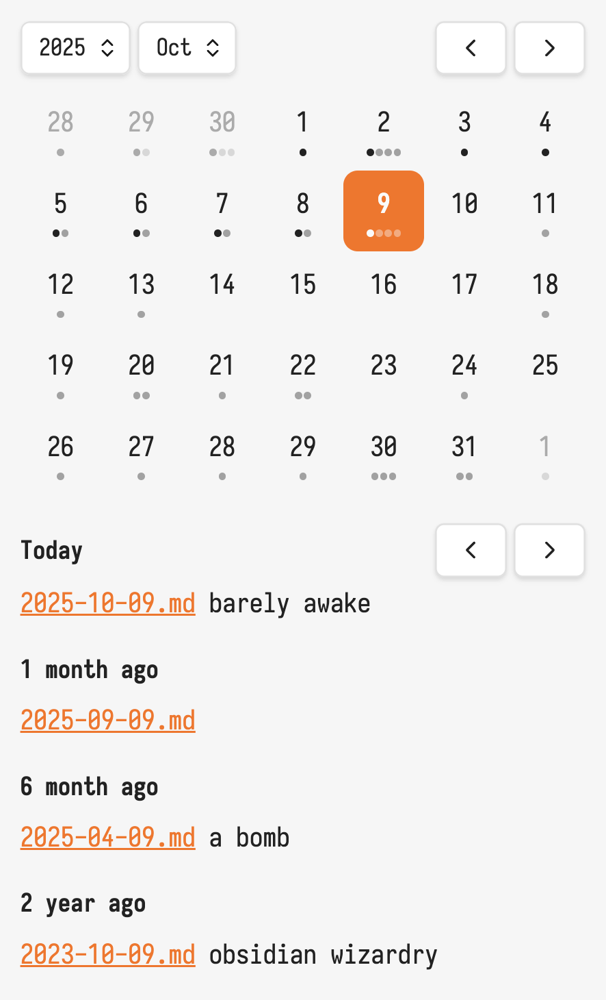

# On This Day

This plugin adds a funtionality similar to Day One app. It allows seeing notes happend "on this day" a 1 2 5 years ago.



## Settings

Daily Folder - The where daily notes are stored.

Which Month - For which months to show entries. For example 1,6 would show entries for 1 month ago and 6 months ago.

Which Year - For which years to show entries.

## Development

```sh
npm i
npm run dev
```

## Releasing new releases

- Update your `manifest.json` with your new version number, such as `1.0.1`, and the minimum Obsidian version required for your latest release.
- Update your `versions.json` file with `"new-plugin-version": "minimum-obsidian-version"` so older versions of Obsidian can download an older version of your plugin that's compatible.
- Create new GitHub release using your new version number as the "Tag version". Use the exact version number, don't include a prefix `v`. See here for an example: https://github.com/obsidianmd/obsidian-sample-plugin/releases
- Upload the files `manifest.json`, `main.js`, `styles.css` as binary attachments. Note: The manifest.json file must be in two places, first the root path of your repository and also in the release.
- Publish the release.

> You can simplify the version bump process by running `npm version patch`, `npm version minor` or `npm version major` after updating `minAppVersion` manually in `manifest.json`.
> The command will bump version in `manifest.json` and `package.json`, and add the entry for the new version to `versions.json`
